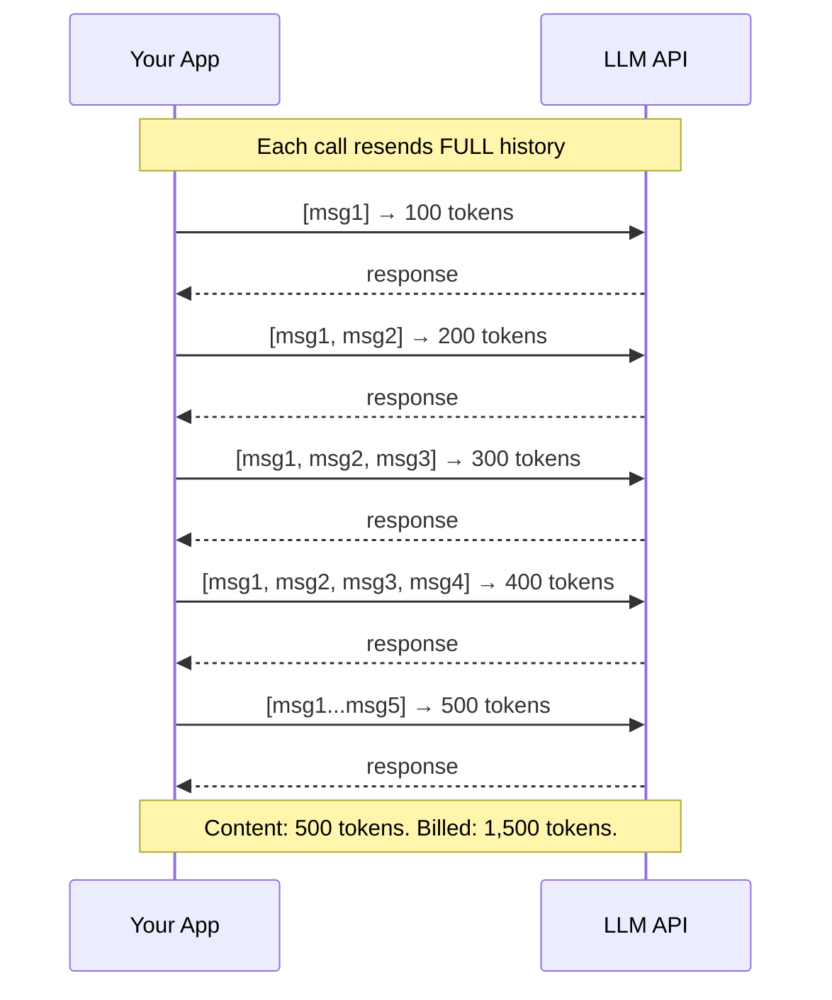
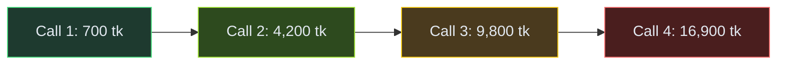
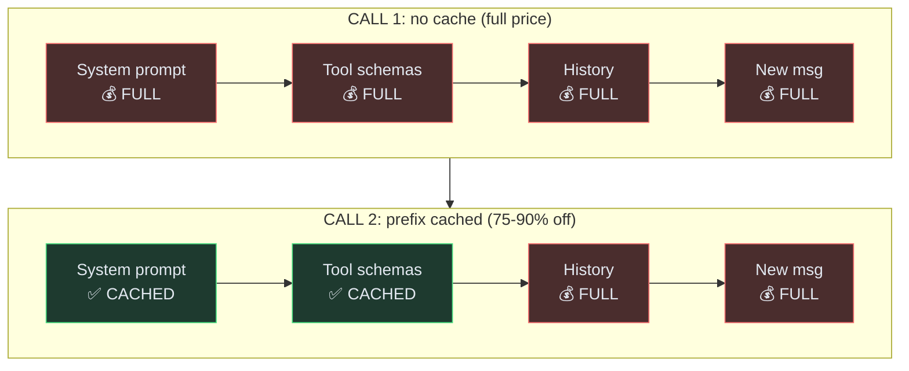

# Deep diving into how LLM API pricing works

Been using Claude Code for a while now. Pro plan, fixed monthly charge, unlimited usage. Never had a reason to think about tokens. They're just... there. The tool works, the bill doesn't change.

Then a few weeks ago, while building a ReAct agent from scratch, things got real. The agent needed LLM API calls (Gemini, specifically) and suddenly every token had a price tag. One question to the agent ("describe the architecture of this project") took 4 API calls and burned through nearly 17,000 tokens. The actual useful content in those calls? Maybe 4,000 tokens. The rest was the same context being resent over and over.

That gap between what's useful and what's billed turns out to have a clean mechanical explanation. And once you see it, you can't unsee it.

Repo: [`arsh14jain/agentic-ai`](https://github.com/arsh14jain/agentic-ai)

---

## Tokens: the quick version

LLMs don't read characters. They read tokens, subword chunks learned during training. "understanding" might be one token. "un" + "derstand" + "ing" might be three. Depends on the tokenizer.

Density varies by content type. English prose is roughly 4 characters per token. JSON with all its brackets and quotes? Closer to 3. This matters because billing is per token, and different content has different token density.

Input and output are billed separately. Output costs more, typically 3-4x. Why? Input tokens are processed in parallel. The model sees the whole prompt at once (the "prefill" phase). Output tokens are generated one at a time, sequentially, each requiring its own forward pass. Sequential work is just more expensive to serve.

---

## The thing nobody tells you: the n-squared problem

Here's the core insight that changes everything.

LLM APIs are stateless. No session. No "continue where we left off." Every API call sends the entire conversation history from scratch.

Not a design flaw. Providers physically can't keep model state alive for millions of concurrent users. The internal state (attention KV-cache) for a single conversation on a large model can be gigabytes. Multiply by millions of users and the math breaks. Stateless is the only architecture that scales.

But it means every turn of a conversation resends everything that came before.



500 tokens of actual content. 1,500 tokens billed. 3x overhead.

The formula is the sum of 1 to n: **n(n+1)/2**. Quadratic. At 50 turns, that's 1,275 units of context to deliver 50 units of content. 25x.

---

## Agents make this worse

A chatbot makes one API call per message. An agent makes 5-20. That difference sounds linear. It's not.

Three things drive agent token costs:

1. **Iteration count.** Each loop iteration is another API call carrying the full conversation history.
2. **Tool result size.** A calculator returns 10 tokens. A file read returns 3,000. That 3,000 gets resent on every subsequent call.
3. **Fixed overhead.** System prompt + tool schemas ride along on every single call. For this agent, that's about 600 tokens before any actual conversation starts.

Here's what the agent's `context_heavy` task looked like. 4 API calls to read 3 source files and describe the architecture:

```
Call 1:  system prompt + user query                    ~700 tokens
         → model decides to read agent.py
         → tool returns 3,500 tokens of source code

Call 2:  call 1 context + agent.py result           ~4,200 tokens
         → model decides to read tools.py
         → tool returns 5,600 tokens

Call 3:  calls 1-2 context + tools.py result        ~9,800 tokens
         → model decides to read providers.py

Call 4:  calls 1-3 context + providers.py result   ~16,900 tokens
         → model synthesizes the final answer
```



Total billed: 16,959 tokens. Actual useful content: ~5,000 tokens. The rest is the snowball. Every file read enters history and compounds on every subsequent call.

---

## What actually helps

Once you see the snowball, the fix is obvious: make the snowball smaller.

The biggest source of bloat in agent conversations is tool results. A file read dumps 3,000+ tokens into history, and that payload gets resent on every subsequent call. A calculator returns 10 tokens. The difference in downstream cost is massive.

The simplest thing that worked: **truncate tool results before they enter history.** Clip them at the gate. The model already processed the full result on the call where the tool was invoked. On subsequent calls, it only needs enough context to remember what happened, not the full output.

That same `context_heavy` task from above. Full history: 16,959 tokens. With tool results truncated to 500 chars: 3,748 tokens. Same correct answer. 78% reduction.

In real money on Gemini 2.5 Flash ($0.30/1M input): that single task goes from $0.005 to $0.001. Tiny. But an agent handling 1,000 requests a day? That's $150/month vs $30/month. Scale it to a real product and the difference pays for an engineer.

```python
def on_tool_result(self, result_str):
    """Truncate tool results before they enter history."""
    if len(result_str) > self.max_tool_chars:
        return result_str[:self.max_tool_chars] + '..."}'
    return result_str
```

Other strategies exist (sliding windows, LLM-powered summarization of old messages) but they come with tradeoffs. Sliding windows hard-drop old messages, which kills tasks that need earlier context. Summarization rewrites history, which breaks prompt caching (more on that next). Truncation is the least invasive. It doesn't touch what's already in history. It just makes new entries smaller.

The takeaway: the biggest lever is what goes INTO context, not how you compress it after.

---

## Prompt caching and model routing

Two techniques that matter at scale.

**Prompt caching** addresses the rebilling problem directly. If a request starts with the same tokens as a recent request, the matching prefix is served from cache at a steep discount. Typically 75-90% off.



For agents, system prompt + tool schemas are identical on every call. After the first call, that entire prefix gets cached.

The catch: strategies that rewrite conversation history (like summary compaction) break the prefix. Tokens after the system prompt change, cache misses. Truncation doesn't touch what's already in history. It clips at the gate. Prefix stays intact, cache hits. Another reason truncation wins.

**Model routing** is the other big lever. Not every step in an agent loop needs the same intelligence. Deciding "read this file" is easy. Synthesizing an answer from 3 files is hard. Route simple steps to a cheap model, complex steps to an expensive one.

In practice, 60-75% of agent steps are routine enough for a small model. That's a massive cost reduction without sacrificing quality where it counts. Companies like Portkey, Not Diamond, and Unify have productized routing so you don't build the classifier from scratch. But even a simple heuristic (tool-selection steps go to the small model, final-answer steps go to the big one) gets most of the way there.

---

## Closing thoughts

Per-token prices are dropping fast. Roughly two orders of magnitude per year. But agents consume 10-100x more tokens than chatbots. These two trends are racing each other, and right now, consumption is winning.

The people who'll build cost-effective AI products aren't the ones picking the cheapest model. They're the ones who understand why their agent just billed 17,000 tokens for a 4,000-token answer, and know exactly where to cut.

The code is open source: [`arsh14jain/agentic-ai`](https://github.com/arsh14jain/agentic-ai). Poke around, try different strategies, see what the numbers say.
